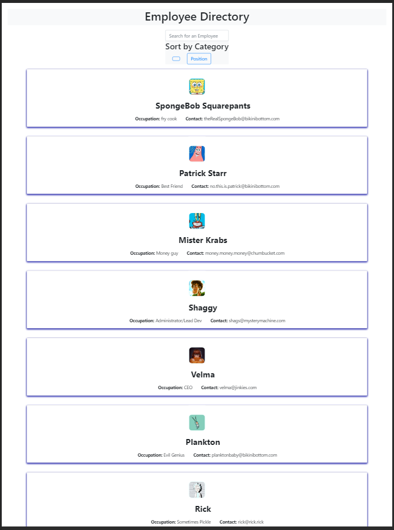

# Employee Directory
This assignment requires us to create an employee directory with React. It requires that we break up our application's UI into components, manage component states, and respond to user events.

## User Story
As a user, I want to be able to view my entire employee directory at once so that I have quick access to employee information.

## Business Context
An employee or manager would benefit from being able to view non-sensitive data about co-workers and other employees. This app would be particularly helpful if it has the ability to filter employees by name.

## Instructions
* Fork the repo to your computer
* Install the required dependencies
* Run 'nmp start'

App should look like this:

